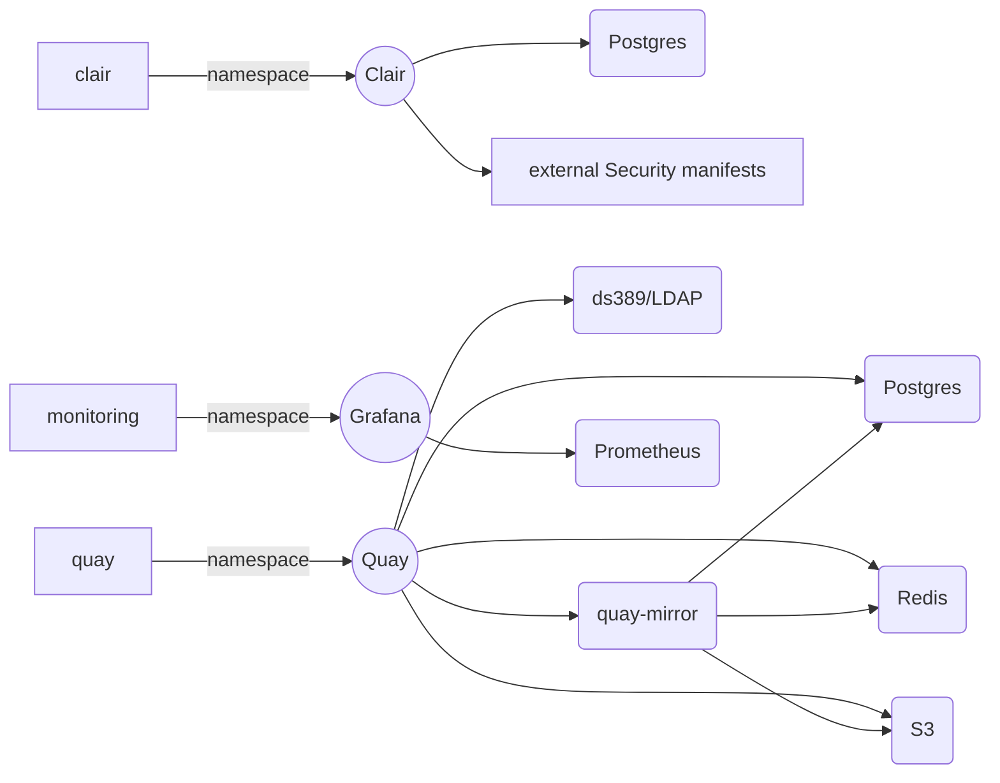
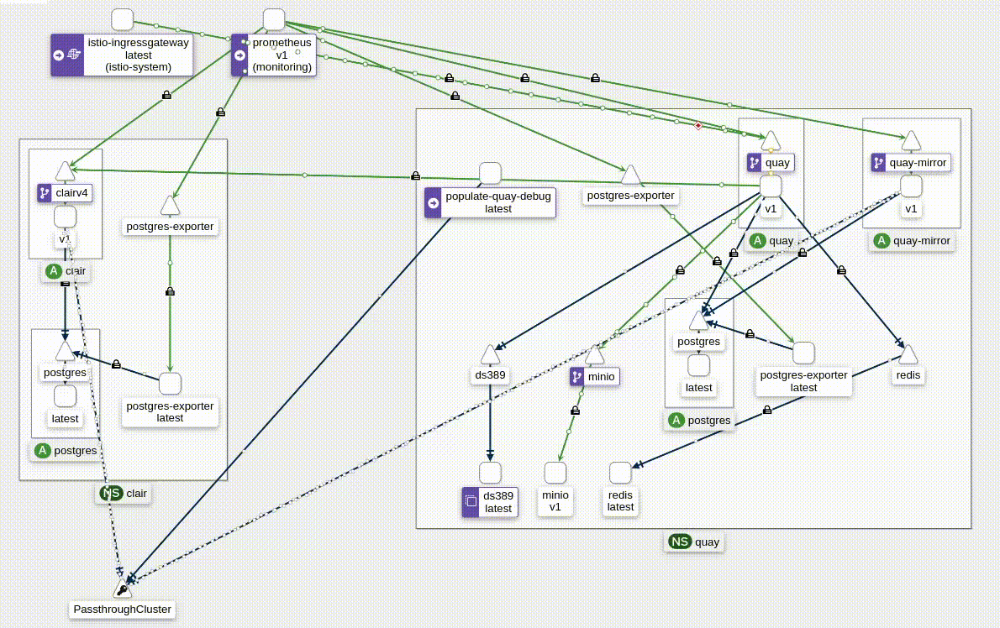
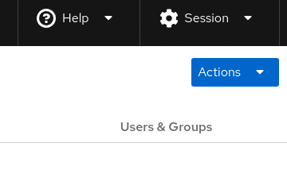
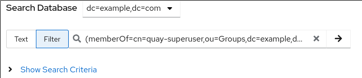
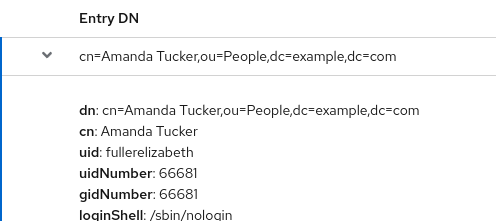

# Quay Demo Lab

This Lab intends to provide an easy deploy and scratch able Quay + Clair deployment. There are as well exercises included to improve understanding on how Quay and Clair work and report certain issues.
A centralized LDAP directory is utilized to populate Organizations, Users, Repositories by using TeamSync to simulate Enterprise scenarios.


# Requirements

Following requirements are necessary upfront to ensure a smooth experience with the Lab

 - podman,skopeo
 - internet access when bootstrapping
 - a git repository access able through https
 - registry credentials to pull various images
 - superuser privileges as kind-k8s doesn't work well with rootless deployments
 - since utilizing `example.com` as domain a DNS service on the system utilized by the Lab
 - firewalld needs to be disabled 
 - ensure, you have been successfully logged in to following registries (using the default image set)
    - registry.redhat.io
    - quay.io
    - docker.io
        ```
        for registry in registry.redhat.io quay.io docker.io ; do 
            podman login ${registry}
        done 
        ```

## Setup and prepare the system 

- install the required packages
	```dnf install -y podman skopeo git dnsmasq```
- adjust inotify settings of the system to spawn a cluster and workload like Quay
    ```
    cat <<EOF> /etc/sysctl.d/kind.conf
    fs.inotify.max_user_instances = 12800
    fs.inotify.max_user_watches = 21155100
    EOF
    sysctl -p /etc/sysctl.d/kind.conf
    ````
- disable firewalld to not conflict with crio rules 

    ```systemctl disable --now firewalld```
- get the system default IP Address for pointing the API to it

    ```API=$(ip route show default | awk ' { print $(NF-2) } ')```
- configure dnsmasq to return the API address and resolv with google DNS (8.8.8.8)
    ```
    cat <<EOF> /etc/dnsmasq.conf
    user=dnsmasq
    group=dnsmasq
    conf-dir=/etc/dnsmasq.d,.rpmnew,.rpmsave,.rpmorig
    server=8.8.8.8
    address=/quay-demo-control-plane/${API}
    address=/quay-demo-control-plane.example.com/${API}
    EOF
    systemctl enable --now dnsmasq
    ```
    you also need to ensure that, resolution is done through the deployed dnsmasq service 
    ```
    cat <<EOF> /etc/resolv.conf
    search local example.com
    nameserver ${API}
    EOF
    ```

- download the binaries to utilize kind (k8s), flux (gitops), oc/kubectl (mgmt), kustomize (build/verify)
    ```
    curl -o/usr/bin/kind -L -s https://github.com/kubernetes-sigs/kind/releases/download/v0.17.0/kind-linux-amd64
    chmod +x /usr/bin/kind
    curl -s -L -o- https://github.com/fluxcd/flux2/releases/download/v0.39.0/flux_0.39.0_linux_amd64.tar.gz | tar -xzf- -C /usr/bin/
    chmod +x /usr/bin/flux
    curl -L -o- https://mirror.openshift.com/pub/openshift-v4/clients/ocp/latest/openshift-client-linux.tar.gz | tar -xzf- -C /usr/bin oc kubectl
    chmod +x /usr/bin/{oc,kubectl}
    curl -L -o- https://github.com/kubernetes-sigs/kustomize/releases/download/kustomize%2Fv5.0.0/kustomize_v5.0.0_linux_amd64.tar.gz | tar -xzf- -C /usr/bin/ kustomize
    chmod +x /usr/bin/kustomize
    ```

## Clone the repository 

clone the repository from https://github.com/michaelalang/quay-demo-lab.git to your local file system

    git clone https://github.com/michaelalang/quay-demo-lab.git
for the Gitops deployment choosen in the Demo Lab this repo needs to be available as well through https to the cluster we are going to bootstrap. You can utilize the origin from github if you don't want to spawn your own git repository but you'll loose the option to modify content accordingly.

## Bootstrap the k8s kind cluster

the configuration of the Cluster is defined in the file `quay-demo-lab.yml`. If you want to have more or less Nodes, adjusting the configuration can be done.
One mandatory item to be modified is the `apiServerAddress`. This should point to your primary interface IP address to ensure the bootstrap process on joining Nodes will succeed.
```
cd quay-demo-lab
sed -i -e " s#apiServerAddress: 127.0.0.1#apiServerAddress: ${API}#; " quay-demo-lab.yml
kind create cluster --config quay-demo-lab.yml
```

### load additional images from `protected` registries

to avoid pushing credentials into the Lab Cluster, as well as speeding up deployment, we will pull the images and load them into the Cluster instead
```
for img in registry.redhat.io/quay/clair-rhel8:v3.8.3-2 registry.redhat.io/rhel8/postgresql-10:1-157 registry.redhat.io/quay/quay-rhel8:v3.8.3-2 ; do
    podman pull ${img}
    podman image save -o image.latest.tar ${img}
    kind --name quay-demo load image-archive image.latest.tar && rm -f image.latest.tar
done
```

## Deploy Gitops controllers

For size and complexity reasons, [fluxcd](https://fluxcd.io) has been chosen to automate the deployment as much as possible.
This `much as possible` depends on the performance of your system which is the reason to have certain `wait` conditions during the process.
```
oc create -f base/install.yaml
while ! oc -n flux-system wait --for=jsonpath='{.status.readyReplicas}'=1 deploy/kustomize-controller ; do sleep 1 ; done
while ! oc -n flux-system wait --for=jsonpath='{.status.readyReplicas}'=1 deploy/source-controller ; do sleep 1 ; done
```

## Deploy Lab source and base applications 

ensure to update the file `base/sources.yml` if you do not want to pull the configurations from the origin repository on github.com but instead use your own git repository
```
apiVersion: source.toolkit.fluxcd.io/v1beta2
kind: GitRepository
metadata:
  name: quay-demo-source
  namespace: flux-system
spec:
  interval: 30s
  ref:
    branch: main
  url: https://github.com/michaelalang/quay-demo-lab.git
```
the definition of the base apps deploys following mandatory services in the cluster

- metallb  - Metal LB to provide IP addresses for Services type LoadBalancer
    - metallb-ips -  A fixed range of IPs to smoothen the Lab deployment
- traefik - Traefik ingress for none ServiceMesh enclosed services (like kiali)
- cert-manager - Certificates for example.com 
- istio - ServiceMesh based on istio
```
oc create -f base/sources.yml
oc create -f base/baseapps.yml

while ! flux get kustomization istio --no-header | grep True ; do flux reconcile kustomization istio ; sleep 10 ; done
while ! oc -n istio-system wait --for=jsonpath='{.status.readyReplicas}'=1 deploy/istio-ingressgateway ; do sleep 1 ; done
```
## update dnsmasq to reflect our k8s cluster addresses

after the base apps deployment has finished, we need to update the example.com domain configuration we are utilizing in the Lab to reach the services from our host as well. (if you want to use a second host, ensure you point the resolv.conf as well as adding the IP range assigned to the podman kind network configuration)
```
ISTIO=$(oc -n istio-system get svc istio-ingressgateway -o jsonpath='{.status.loadBalancer.ingress[0].ip }')
TRAEFIK=$(oc -n kube-system get svc traefik -o jsonpath='{.status.loadBalancer.ingress[0].ip }')

cat <<EOF>> /etc/dnsmasq.conf
address=/kiali.example.com/${TRAEFIK}
address=/ds389.example.com/${TRAEFIK}
address=/prometheus.example.com/${TRAEFIK}
address=/quay.example.com/${ISTIO}
address=/minio.example.com/${ISTIO}
address=/minio-ui.example.com/${ISTIO}
address=/clair.example.com/${ISTIO}
address=/grafana.example.com/${ISTIO}
address=/quay-mirror.example.com/${ISTIO}
EOF
systemctl restart dnsmasq
```

## deploy the Quay Demo applications 

```
oc create -f base/quay-demo.yml
while ! oc -n quay wait --for=jsonpath='{.status.readyReplicas}'=1 deploy/quay ; do sleep 10 ; done

``` 
this CRD will populate various `kustomization` definitions as used by fluxcd to be deployed in the Cluster without manually configuring each and every deployment,service,persistentvolumeClaim,... 
The structure of what get's deployed is as follows 

in `kiali` the ServiceMesh [frontend](http://kiali.example.com/kiali/console/graph/namespaces/?traffic=grpc%2CgrpcRequest%2Chttp%2ChttpRequest%2Ctcp%2CtcpSent&graphType=versionedApp&namespaces=istio-system%2Cclair%2Cmonitoring%2Cquay&duration=60&refresh=10000&layout=kiali-breadthfirst&namespaceLayout=kiali-breadthfirst) will show you that dependencies as well

## identify the generated super users for Quay in LDAP
no worries, if you haven't had a chance to take a look a LDAP, the documentation will guide you through to identify a valid uid to login to Quay as super user.

 - [open](http://ds389.example.com/389-console) a browser on the Host running the created Cluster
	 -  select the tab `Users & Groups`

 - next select `Search` and select `Filter` with the value of
	- `(memberOf=cn=quay-superuser,ou=Groups,dc=example,dc=com)`

 - next select any Entry and expand the values by clicking on the arrow next to the name
	- copy or write down the `uid` value (**NOTE** the values are generate and expected to change with every run)

 - login to the [Quay UI](https://quay.example.com) with the value of `uid` as `Username` and the password of `changeme`.
	- *NOTE* the password for all accounts has been set to `changeme`
## create an Organization and Application with super user scoped privileges
this manual step is mandatory as the Quay configuration is set to `SETUP_COMPLETE: true` which prevents automatically bootstrapping tokens.
 - Login to the [Quay UI](https://quay.example.com) with the super user credentials identified in the step above
 - Click the `+`(plus) icon on the upper right hand corner
 - Click `New Organization`
	 - pick any name you want
 - Click on the `Applications` icon on the left bar located second from the bottom
	 - Click `Create New Application`on the upper right hand corner
		 - enter any name you want in the Box that is opened up when clicking
 - Click the newly create Application in the list of your screen
 - Click the `Generate Token` icon on the left bar locate at the very bottom
	  - ensure to check all boxes to be able to populate various scenarios through this token 
		  - **NOTE** this configuration is not recommended for any production purpose 
 - Click the `Authorize Application` button on the bottom of the summary page 
 - Click the `Authorize Application` button again in the Confirmation pop up
 - write down the `Access Token` value you are provided with 
	  - **NOTE** this value is not revealed any more when closing the window. You will need to create another Token if you do not write down the values accordingly.
## populate random Organizations, Users and repositories for Demo purpose
with the `Access Token` created in the step above, we need to share that with the job which is going to populate some random Organization, Users and repositories.
 - populate the superuser Token as secret for your namespace
```
TOKEN="app-token-superuser-scoped"
oc -n quay create secret generic quay-superuser-token --from-literal=TOKEN=${TOKEN}
```
- build an image and push it to the registry 
	- unfortunately, a chicken-egg problem makes it necessary to accept the cluster pulling the image from the self-signed certificate based registry
	- the last two steps are *only* necessary in the Demo Lab due to the self-signed based certificate ingress
```
USER="your-choosen-superuser"

mkdir -p /etc/docker/certs.d/quay.example.com/
echo | openssl s_client -connect quay.example.com:443 | openssl x509 -out /etc/docker/certs.d/quay.example.com/tls.crt

podman login -u ${USER} -p changeme quay.example.com
podman build -t quay.example.com/${USER}/quay-demo-publisher:latest --build-arg VERSION=9 .
podman push quay.example.com/${USER}/quay-demo-publisher:latest 

podman image save -o quay-demo-publisher.latest.tar quay.example.com/${USER}/quay-demo-publisher:latest
kind --name quay-demo load image-archive quay-demo-publisher.latest.tar
```
- now deploy a job which will populate quay with random Organizations, Users, respositories
```
USER="your-choosen-superuser"
sed -e " s#localhost/quay-demo-publisher:latest#quay.example.com/${USER}/quay-demo-publisher:latest#; " base/quay-publish-job.yml |oc -n quay create -f -
```
## push and pull some more images to populate clair security reports 
with that one image being available in our repository, reports and interaction with clair is very limited. So we do generate more images similar and based upon different OS base version.
```
for v in 7 8 9 ; do 
    podman build -t quay.example.com/${USER}/quay-demo-publisher:ubi${v} --build-arg VERSION=${v} .
    podman push quay.example.com/${USER}/quay-demo-publisher:ubi${v}
done
```
even though, Clair might not has finished indexing and generating the Vulnerability reports for those images, we can pull them and use them accordingly.
```
for v in 7 8 9 ; do skopeo copy docker://quay.example.com/${USER}/quay-demo-publisher:ubi${v} dir://tmp/ubi${v} ; done
```
We store the content of those images into directories for future exercises

# Exercises 

Now with a running and verified working Quay, we are going to put it into various error situations
You can already take a look at the exposes [metrics](https://grafana.example.com) login with `admin/admin` and hit the `Quay Monitoring` Dashboard in the General Folder.

[Continue](exercises/README.md) with the Exercises as you wish.
