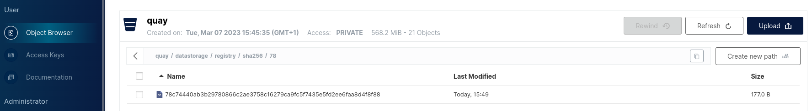

# Quay Demo Lab Scenario 1

Our Quay is up and running working fine. Some users started to report problems fetching random Images. To simplify the scenario we are going to reproduce the issue just with one image and collect the required logs from the Quay system.

# Requirements
- The Quay Demo Lab has to be running and working as described in the [Welcome](../README.md) page.

## prepare step1 

- suspend the automated reconciliation from flux
	```flux suspend kustomization quay```
- apply the configuration for the scenario
    ```
    oc -n quay replace -f exercises/scenario1/step1.yml
    ````
### step 1 

We will use the image created in the Welcome [section](../README.md#push-and-pull-some-more-images-to-populate-clair-security-reports). Choose a version (for example **9**) and try to pull that image
```
USER="your-choosen-superuser"
skopeo copy docker://quay.example.com/${USER}/quay-demo-publisher:ubi9 dir://tmp/ubi9
Getting image source signatures
Copying blob 2a625e4afab5 done  
Copying blob 78c74440ab3b [--------------------------------------] 0.0b / 177.0b
Copying blob bd3be51ab635 done  
Copying blob a625b6ecb6f1 done  
Copying blob 90284675a5ee done  
FATA[0004] reading blob sha256:78c74440ab3b29780866c2ae3758c16279ca9fc5f7435e5fd2ee6faa8d4f8f88: Error fetching blob: invalid status code from registry 520 () 
```
**NOTE** your error might look differently in relation to which layer is reporting an error. 

### analyse what is not working
in  the particular example, we see that image blob **sha256:78c74440ab3b29780866c2ae3758c16279ca9fc5f7435e5fd2ee6faa8d4f8f88** is reporting and error with the output of **invalid status code from registry 520 ()**

Your Quay has been deployed running `DEBUGLOG=true` so you need to be as precised as possible when looking for errors.
The following command will output Quay logs  and grep for our **sha** and the HTTP status code of **520** 
**NOTE** for grepping for HTTP status codes the syntax is 
```
oc -n quay logs deploy/quay | grep 78c74440ab3b29780866c2ae3758c16279ca9fc5f7435e5fd2ee6faa8d4f8f88  | egrep -e 'HTTP/1\.." 520 '
nginx stdout | 127.0.0.6 (-) - - [07/Mar/2023:15:49:40 +0000] "GET /_storage_proxy/ZXlKMGVYQWlPaUpLVjFRaUxDSmhiR2NpT2lKU1V6STFOaUlzSW10cFpDSTZJak5VTTFCTVQxUnJkamxRVUhnNE56VlhaMmhoYjBZNFkyVklSVzEzU2pWRFVrNUxhbTFpTURCS1kzY2lmUS5leUpwYzNNaU9pSnhkV0Y1SWl3aVlYVmtJam9pY1hWaGVTNWxlR0Z0Y0d4bExtTnZiU0lzSW01aVppSTZNVFkzT0RJd05ERTRNQ3dpYVdGMElqb3hOamM0TWpBME1UZ3dMQ0psZUhBaU9qRTJOemd5TURReU1UQXNJbk4xWWlJNkluTjBiM0poWjJWd2NtOTRlU0lzSW1GalkyVnpjeUk2VzNzaWRIbHdaU0k2SW5OMGIzSmhaMlZ3Y205NGVTSXNJblZ5YVNJNkluRjFZWGt2WkdGMFlYTjBiM0poWjJVdmNtVm5hWE4wY25rdmMyaGhNalUyTHpjNEx6YzRZemMwTkRRd1lXSXpZakk1Tnpnd09EWTJZekpoWlRNM05UaGpNVFl5TnpsallUbG1ZelZtTnpRek5XVTFabVF5WldVMlptRmhPR1EwWmpobU9EZ19RVmRUUVdOalpYTnpTMlY1U1dROWJXbHVhVzloWkcxcGJpWlRhV2R1WVhSMWNtVTliMkp4WjNGcVZsVlFZMlZsYlhwVGEzRm5URlJTWkRNNFJVSkpKVE5FSmtWNGNHbHlaWE05TVRZM09ESXdORGM0TUNJc0ltaHZjM1FpT2lKdGFXNXBieTV4ZFdGNUxuTjJZeTVqYkhWemRHVnlMbXh2WTJGc09qa3dNREFpTENKelkyaGxiV1VpT2lKb2RIUndJbjFkTENKamIyNTBaWGgwSWpwN2ZYMC5ScHFqbjVlRXpRUTJTNk9Tbk5GYjNkZTRiS1FsMUFOT3pHcHFXbjNvNGw5NXVieE02RnlQTGFHUHRCT3c0YmhSYlliYlFSQTFGSjNndERaV0xXOThscWU1emRSZEZKUHV5WWpwV0FKelVWY21uLXR5d2EyLWdFQ2JZQ2RiMG1rSDRsallrUHltS2VSSVhURTU1TnNxbGo4SUVRVXp5MVdDNEw4WEdYV3R3SVJQNld6ZmtFYk9CNEpzVE9nbFJJeW9Bc3hjejFjYXZaMWhNNUlKdV9GMEFWbEthMGI5MXJRLWFGQVE0ZC1xZEJjUWhzRmV4Q29PRTFiLUV1YkVEWkJITnBaQld3dHF4NWpuSzRGLThzU2RsYl9najBkOVdVelNmSDJWRjF1T3dXSjFGcktPSDUyYUt3cE9aZkpTX2NuNUR0TFJWRTBLRTQ4b2VxdEM2REdJY2c=/http/minio.quay.svc.cluster.local:9000/quay/datastorage/registry/sha256/78/78c74440ab3b29780866c2ae3758c16279ca9fc5f7435e5fd2ee6faa8d4f8f88?AWSAccessKeyId=minioadmin&Signature=obqgqjVUPceemzSkqgLTRd38EBI%3D&Expires=1678204780 HTTP/1.1" 520 18 "https://quay.example.com/v2/sarahudson/quay-demo-publisher/blobs/sha256:78c74440ab3b29780866c2ae3758c16279ca9fc5f7435e5fd2ee6faa8d4f8f88" "skopeo/1.9.4-dev" (0.004 3452 0.001)
``` 
we can identify a few items in that log to verify we have matched the request which has failed 

- the client/User-Agent string *"skopeo/1.9.4-dev" (0.004 3452 0.001)*
- the HTTP error response received *HTTP/1.1" 520* 
- the URL which was requested *"https://quay.example.com/v2/sarahudson/quay-demo-publisher/blobs/sha256:78c74440ab3b29780866c2ae3758c16279ca9fc5f7435e5fd2ee6faa8d4f8f88"*
- the sha *sha256:78c74440ab3b29780866c2ae3758c16279ca9fc5f7435e5fd2ee6faa8d4f8f88*

we can as well identify that we are running with `FEATURE_PROXY_STORAGE` due to the path in the request being logged
`/_storage_proxy/ZXlK...` and we can identify that the proxy is our nginx `nginx stdout`
furthermore, we see the backend storage that the request is addressing `/http/minio.quay.svc.cluster.local:9000/quay/datastorage/registry/sha256/78/78c7...` 

To further analyse the error, we *ring the Storage Admin* and he get's back to us with, I fixed the problem.

## prepare step2 

- apply the configuration for the scenario
    ```
    oc -n quay replace -f exercises/scenario1/step2.yml
    ````
### step 2
With the Storage Admin fixing the problem we give the image pull another try.
```
USER="your-choosen-superuser"
skopeo copy docker://quay.example.com/${USER}/quay-demo-publisher:ubi9 dir://tmp/ubi9
Getting image source signatures
Copying blob 2a625e4afab5 done  
Copying blob 78c74440ab3b [--------------------------------------] 0.0b / 177.0b
Copying blob bd3be51ab635 done  
Copying blob a625b6ecb6f1 [--------------------------------------] 0.0b / 226.0b
Copying blob 90284675a5ee done  
FATA[0004] reading blob sha256:78c74440ab3b29780866c2ae3758c16279ca9fc5f7435e5fd2ee6faa8d4f8f88: Error fetching blob: invalid status code from registry 404 (Not Found) 
```
well it seems, the colleague is part of the BOFH department.

### analyse what is not working
in  the particular example, we see that image blob **sha256:78c74440ab3b29780866c2ae3758c16279ca9fc5f7435e5fd2ee6faa8d4f8f88** is reporting and error with the output of **invalid status code from registry 404 (Not Found)**

**NOTE** it might need several occasions to hit the exact same blob as in the first run but for convenience reason the Lab exercise assumes, the errors are real errors and not generated.

The following command will output Quay logs  and grep for our **sha** and the HTTP status code of **404** 
```
oc -n quay logs deploy/quay | grep 78c74440ab3b29780866c2ae3758c16279ca9fc5f7435e5fd2ee6faa8d4f8f88  | egrep -e 'HTTP/1\.." 404 '
nginx stdout | 127.0.0.6 (-) - - [07/Mar/2023:16:09:38 +0000] "GET /_storage_proxy/ZXlKMGVYQWlPaUpLVjFRaUxDSmhiR2NpT2lKU1V6STFOaUlzSW10cFpDSTZJak5VTTFCTVQxUnJkamxRVUhnNE56VlhaMmhoYjBZNFkyVklSVzEzU2pWRFVrNUxhbTFpTURCS1kzY2lmUS5leUpwYzNNaU9pSnhkV0Y1SWl3aVlYVmtJam9pY1hWaGVTNWxlR0Z0Y0d4bExtTnZiU0lzSW01aVppSTZNVFkzT0RJd05UTTNPQ3dpYVdGMElqb3hOamM0TWpBMU16YzRMQ0psZUhBaU9qRTJOemd5TURVME1EZ3NJbk4xWWlJNkluTjBiM0poWjJWd2NtOTRlU0lzSW1GalkyVnpjeUk2VzNzaWRIbHdaU0k2SW5OMGIzSmhaMlZ3Y205NGVTSXNJblZ5YVNJNkluRjFZWGt2WkdGMFlYTjBiM0poWjJVdmNtVm5hWE4wY25rdmMyaGhNalUyTHpjNEx6YzRZemMwTkRRd1lXSXpZakk1Tnpnd09EWTJZekpoWlRNM05UaGpNVFl5TnpsallUbG1ZelZtTnpRek5XVTFabVF5WldVMlptRmhPR1EwWmpobU9EZ19RVmRUUVdOalpYTnpTMlY1U1dROWJXbHVhVzloWkcxcGJpWlRhV2R1WVhSMWNtVTlUM2xRVmxrbE1rWnRiRmhLT1d0eFVsTkNkbFpuZFhCbmJXbHZRVGdsTTBRbVJYaHdhWEpsY3oweE5qYzRNakExT1RjNElpd2lhRzl6ZENJNkltMXBibWx2TG5GMVlYa3VjM1pqTG1Oc2RYTjBaWEl1Ykc5allXdzZPVEF3TUNJc0luTmphR1Z0WlNJNkltaDBkSEFpZlYwc0ltTnZiblJsZUhRaU9udDlmUS5FY1FEREVVeEtHc0hDY0QtQllQbk9JVV90NjNrZmZuQmJualRxQnJyT29ndzUwa016YWFPQ3hIbmRDanN0M1pVY2VXQlRTQkd0eXhyUExZV1A2T0c0R1VKSUx3OWxTY253dFY0N0FiOFFRYjhjZjQ0SFRlMmh2MzNLNl8xQW0zZzdKVTFSTjlMUGJVM1c4ekJqRkJPNzlVa0oxejJaNS1UMkZEeFdMNlV1SjZ5aEpIRU1aVDlMQVlreGNkMWxjRzY0eWwyeUVyTGFoVF9oNjg1aFl2MU9TQVpULWFsOWVOalo5aWprNzZxcEZiOFR0OUtXVUZjNElSb0Z5SHQ2OWN0MXd4a0N3eDZFSEZZdmZOaWxNMFctNU81d05TbFRXM2tmMlZwWGpLQmRtS2pkTzljSU41XzZPOUUzUkF6bDFxNnJsel9KNnp1S3lhcHNJVllJNEptU0E=/http/minio.quay.svc.cluster.local:9000/quay/datastorage/registry/sha256/78/78c74440ab3b29780866c2ae3758c16279ca9fc5f7435e5fd2ee6faa8d4f8f88?AWSAccessKeyId=minioadmin&Signature=OyPVY%2FmlXJ9kqRSBvVgupgmioA8%3D&Expires=1678205978 HTTP/1.1" 404 18 "https://quay.example.com/v2/sarahudson/quay-demo-publisher/blobs/sha256:78c74440ab3b29780866c2ae3758c16279ca9fc5f7435e5fd2ee6faa8d4f8f88" "skopeo/1.9.4-dev" (0.004 3458 0.000)
``` 
we can identify a few items in that log to verify we have matched the request which has failed 

- the client/User-Agent string *"skopeo/1.9.4-dev" (0.004 3452 0.001)*
- the HTTP error response received *HTTP/1.1" 404* 
- the URL which was requested *"https://quay.example.com/v2/sarahudson/quay-demo-publisher/blobs/sha256:78c74440ab3b29780866c2ae3758c16279ca9fc5f7435e5fd2ee6faa8d4f8f88"*
- the sha *sha256:78c74440ab3b29780866c2ae3758c16279ca9fc5f7435e5fd2ee6faa8d4f8f88*

we can now start to verify if the blob is in the S3 storage backend by parsing the header  from 
`/http/minio.quay.svc.cluster.local:9000/quay/datastorage/registry/sha256/78/78c7...` 
to 
`http://minio.quay.svc.cluster.local:9000/quay/datastorage/registry/sha256/78/78c7...` 

To further analyse the error, we *ring the Storage Admin* and he get's back to us with, I fixed the problem.
Open a browser window to the [S3 Storage](https://minio.example.com) with credentials `minioadmin:minioadmin` and try to access the blob *manually*


According to real-life examples, you would take action on restoring the blob either from the source or a backup. (see [Scenario 11](scenario11.md) Verification of Quay and Storage)
Since the error we see is injected by Istio, the blob is there and valid, so we can continue with step 3.

## prepare step3

- apply the configuration for the scenario
    ```
    exercises/scenario1/step3.sh
    ```
 ### step 3

We do want to push an new image and receive following error when executing the command
```
skopeo copy docker://docker.io/alpine:latest docker://quay.example.com/sarahudson/alpine:latest 
Getting image source signatures
FATA[0002] copying system image from manifest list: trying to reuse blob sha256:63b65145d645c1250c391b2d16ebe53b3747c295ca8ba2fcb6b0cf064a4dc21c at destination: unable to retrieve auth token: invalid username/password: unauthorized: Invalid password 
```
Well even though the phrase `Invalid password` shouldn't be there it indicates what we are looking for in the logs.

``` 
oc -n quay logs deploy/quay -f | egrep -ie 'ldap.*$'
gunicorn-registry stdout | 2023-03-07 17:30:40,979 [265] [DEBUG] [data.users.externalldap] Incoming username or email param: 'sarahudson'
gunicorn-registry stdout | 2023-03-07 17:30:40,980 [265] [DEBUG] [data.users.externalldap] Conducting user search: (|(uid=sarahudson)(mail=sarahudson)) under ou=People,dc=example,dc=com
gunicorn-registry stdout | 2023-03-07 17:30:40,980 [265] [DEBUG] [data.users.externalldap] Found matching DNs: ['cn=Amy Burns,ou=People,dc=example,dc=com']
gunicorn-registry stdout | 2023-03-07 17:30:40,981 [265] [DEBUG] [data.users.externalldap] Found user for LDAP username sarahudson; validating password
gunicorn-registry stdout | 2023-03-07 17:30:40,982 [265] [DEBUG] [data.users.externalldap] DN cn=Amy Burns,ou=People,dc=example,dc=com found: {'cn': [b'Amy Burns'], 'uid': [b'sarahudson'], 'uidNumber': [b'39637'], 'gidNumber': [b'39637'], 'loginShell': [b'/sbin/nologin'], 'homeDirectory': [b'/home/sarahudson'], 'displayName': [b'Amy Burns'], 'memberOf': [b'cn=haynes-shields,ou=Groups,dc=example,dc=com', b'cn=quay-superuser,ou=Groups,dc=example,dc=com', b'cn=allusers,ou=Groups,dc=example,dc=com'], 'shadowExpire': [b'1'], 'shadowInactive': [b'1'], 'shadowLastChange': [b'19423'], 'shadowMax': [b'99999'], 'shadowMin': [b'0'], 'shadowWarning': [b'7'], 'objectClass': [b'top', b'nsPerson', b'nsAccount', b'nsOrgPerson', b'posixAccount', b'shadowaccount', b'inetuser'], 'userPassword': [b'{PBKDF2_SHA256}AAAIAEEU+CG2VHM2CPOKLHtF8PbEyYa14jy27IsBKI8hGFxubtHUHfDXNonSWC1quzmTtQM2c9teT13koSUXXEH+jdfgfou9M4brXCYor4zRGNuznsKC6+4pAMiXuzoL6W2GDZsPDX8UoKvZY73hE7YU4avzZlzjdR4mxUgfI4akeoHpKhI5sE6KqmScfLKew4pJLHtB+i/bl2QCIraGdtT7YI1dO1MZLryicjvgFP2DeN5EGbdlf1AZPUKHuHCfyyQ1pgxPKCDHxniUUJ6wqVSLBY5DPVgc1W1Gbje4G2aTY9+ZhCzQHIJGPWjxe9d3PdFvDxeZLvbxlz9cu0GjarjHgWE/JrzuY9uceehlxUhm8LPvbGBWgoYZWWyuQtKM7s9+IdHpuDGEhpEGfwxWULxHLU2XZtN/prz6C3QE1Uusp2ks']}
gunicorn-registry stdout | 2023-03-07 17:30:40,991 [265] [DEBUG] [data.users.externalldap] Invalid LDAP credentials
```
There's the `USER_DEBUG` setting that would show all LDAP queries in detail but it leaks password in cleartext and here is how you can still verify (if you know the password, or provide the user the instructions) if the Password equals what you expect.
Therefor we borrow a utility shipped with LDAP servers `pwdhash`
```
oc -n quay exec -ti  deploy/ds389 -- /bin/pwdhash -c {PBKDF2_SHA256}AAAIAEEU+CG2VHM2CPOKLHtF8PbEyYa14jy27IsBKI8hGFxubtHUHfDXNonSWC1quzmTtQM2c9teT13koSUXXEH+jdfgfou9M4brXCYor4zRGNuznsKC6+4pAMiXuzoL6W2GDZsPDX8UoKvZY73hE7YU4avzZlzjdR4mxUgfI4akeoHpKhI5sE6KqmScfLKew4pJLHtB+i/bl2QCIraGdtT7YI1dO1MZLryicjvgFP2DeN5EGbdlf1AZPUKHuHCfyyQ1pgxPKCDHxniUUJ6wqVSLBY5DPVgc1W1Gbje4G2aTY9+ZhCzQHIJGPWjxe9d3PdFvDxeZLvbxlz9cu0GjarjHgWE/JrzuY9uceehlxUhm8LPvbGBWgoYZWWyuQtKM7s9+IdHpuDGEhpEGfwxWULxHLU2XZtN/prz6C3QE1Uusp2ks changeme
pwdhash: password does not match.
```
We do recall that we recently changed our password and to verify we execute the same command again with the new password:
```
oc -n quay exec -ti  deploy/ds389 -- /bin/pwdhash -c {PBKDF2_SHA256}AAAIAEEU+CG2VHM2CPOKLHtF8PbEyYa14jy27IsBKI8hGFxubtHUHfDXNonSWC1quzmTtQM2c9teT13koSUXXEH+jdfgfou9M4brXCYor4zRGNuznsKC6+4pAMiXuzoL6W2GDZsPDX8UoKvZY73hE7YU4avzZlzjdR4mxUgfI4akeoHpKhI5sE6KqmScfLKew4pJLHtB+i/bl2QCIraGdtT7YI1dO1MZLryicjvgFP2DeN5EGbdlf1AZPUKHuHCfyyQ1pgxPKCDHxniUUJ6wqVSLBY5DPVgc1W1Gbje4G2aTY9+ZhCzQHIJGPWjxe9d3PdFvDxeZLvbxlz9cu0GjarjHgWE/JrzuY9uceehlxUhm8LPvbGBWgoYZWWyuQtKM7s9+IdHpuDGEhpEGfwxWULxHLU2XZtN/prz6C3QE1Uusp2ks changeme1
pwdhash: password ok.
``` 
#### cleanup the scenario
- apply the configuration for the scenario
    ```
    exercises/scenario1/step3-cleanup.sh
    ```
now our password should be working again from the cached auth.json file in `/run/user/$(id -u)/containers/auth.json
```
skopeo copy docker://docker.io/alpine:latest docker://quay.example.com/sarahudson/alpine:latest 
Getting image source signatures
Copying blob 63b65145d645 skipped: already exists  
Copying config b2aa39c304 done  
Writing manifest to image destination
Storing signatures
```
